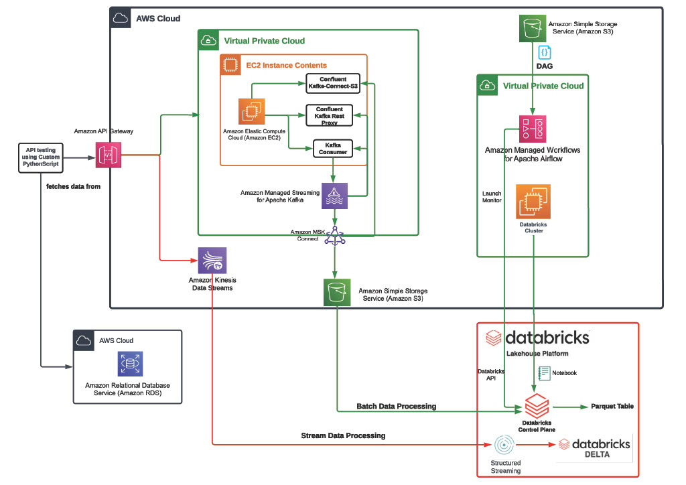
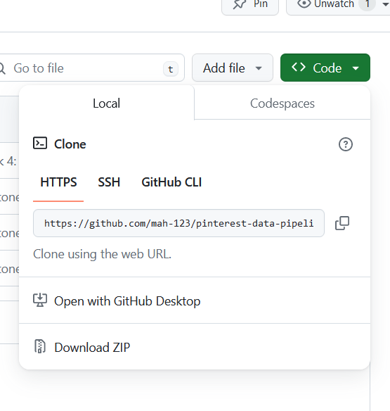

# pinterest-data-pipeline

## Introduction
This project compromises of using user information to implement a pinterest data pipeline by using Kafka and aws3
services.

## 1.1 Creating an EC2 instance environment
For this section you would have to utilise the given IAM user_id information to create the following:
* Find the key pair value associated with the user_id to save the information to a pem.
* Create a EC2 instance on the terminal with the following settings shown on EC2 console.
* Set up the Kafka package on the EC2 intance, finding the arn information to the user_id and kafka clusters setup
* Create the three topics from the user_id information e.g. finding the bootstrap string and the zoo apache string.

This is a follow up to creating the batch processing.

## 1.2 Creating a MSK connection
Once you have created the EC2 instance you would be looking to make MSK:
* Finding the assocaited S3 bucket from the user_id for the IAM account with user info
* downloading the a confluent.io on the EC2 client terminal directly to the S3 bucket
* create a plug-in for MSK, ensuring that the naming of plug-in is assocaited with the user-id
* The MSK plug-in can used to make the MSK connector with right configuration setting to the cluster.

This will enable us to help with setting up API gateway.
## 1.3 Creating a API Gateway for batch processing
After creating the MSK connection, we can use the S3 and the previous kafka topics to store it
into the s3 bucket to collect data from the kafka consumer.
* On the aws specific account, open the API gateway console and create a proxy integration
* copy a your unique endpoint url and apply it to the creates proxy API with all http access
* Set up by deploying the API.
* Once deployed, you would require to download additional confluent package to enable EC2 rest requets 
* Adjust the confluent properties by using nano to change the file and additional info e.g. IAM authentication
* Save the file information and you can start the kafka consumer, to listen in a request.
* Make sure to copy the Invoke_url which will be implemented to user_posting_emulation.py
* Adjust the script to take in the geo, pin and user into payload and add a response to take "post" from the Invoke_URL

## 2.1 Databrick
In this section, when you have created the API gateway to store the three topics, you would need access to your Databricks account which will be mounted to with your AWS S3 bucket access.
* Create a s3 authenitcation file containing access key and security on AWS 
* Once created, upload it directly to databrick csv file.
* Since the csv file was preuploaded for the specific Databrick account, you can a create notebook to munt the S3
* When mounting, ensure that the s3 bucket matches with the previous s3 bucket info and the mount_name should have a suitable name format
* Mounting can be done once, so you do not need to rerun the specific mount scripts
* Once mounted, you can now read directly the .json on the specific topics pin, geo and user into dataframe.
* Make sure the file path to each topics matches to s3 url path e.g."mnt/aws_mount/user_info_file-path/*json." for the file_path variable.
* This should be configured on three topics.

## 2.2 Databrick query
From the previous dataframe created on the notebook, you can use it to query the data for specifc output for user, pin and geo information
which can be seen on the notebook. Before using the data frame, you would need to clean the df_pin, df_user and df_pin for any erroneous value, adjust the order and correcting data type such as age to integer and timestamp for post_date and date_joined column. Some of the query examples using pyspark include:
* popular category for each country
* follower counts for each country
* age groups based on certain category.

## 2.3 Creating autonomous work with Mwaa AWS
After creating query work on your persosnalise databrick notebook, you would need to create a DAG file which will be needed to uploaded on
s3 Bucket (mwaa-dags-bucket under the DAGS folder) for the MWAA work enviroment to work. The following file 0af64aa61d45_dag.py would require following information:
* Notebook_path on the specific notebook used for querying
* Creating a user name to associate with DAG
* Start_date in correct date format
* Number of retries for the schedule cleaning (in int)
* Schedule_intervals you want it be done e.g. @daily or @weekly
* And existing_cluse_id associated with the databricks project (found in the compute section info).
Once uploaded to the s3 Bucket and the DAG file is associated with the user_id for the python file, you can go to
Airflow account under the Databrick-airflow-env (accessed from MWAA aws account) and you will see the specific DAGs assocaited.
Under the DAG info with the associated user_id, you can now activate it manually for it to automatically clean the notebook daily.
Note: make sure you unmount or comment the mounted aws since it will cause an error with trying to clean the notebook frequently.

## 3 AWS kinesis
For this section you need to create three streams on Kinesis aws console for user, pin and geo which will be used to make a stream directly from the new API proxy integration (from the previous rest api we had made for batch processing). With the right API integration for the three topic streams, we will create a new python scripts (previous user_emulation.py) with few adjustment to be sent to the aws kinesis streams. When you run the python scripts, on the aws kinesis associated with the three streams, you can see or view dataviewer on the console to see how data are directly streamed. The data streams cannot maintain the information for a day, so it will require to rerun the programme to gain individual .json file.

These files associated with the three streams created on aws kinesis can be directly attached on notebook by creating a readstream:
* The file streams can be created into three dataframe for user, geo and pin
* Similar to batch processing, you will need clean the dataframe by cast type and removing any error
* From the cleaned dataframe you will need to writestream it to a specific table associated with user_id for user, geo and pin.
Once you have created the table, you can view it on the catalogue section as catalog > hive_metastore > default > user_id.topic.

## Installation
At the moment most of the work would not be accessible due to some of work requires an aws and databricks account to access notebook and run the work. Only work can be accessed are the python scripts.

# To download the work:
Under the code section you will need to copy the url code https://github.com/mah-123/pinterest-data-pipeline317.git and use git clone command
to extract the file (as seen on the image below).
Make sure you download it on a suitable file and use the right IDE environment to run the code.

## License
There is no license required for the project, it is just for demonstrations purposes.
